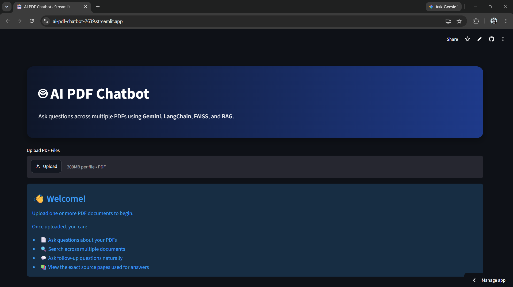
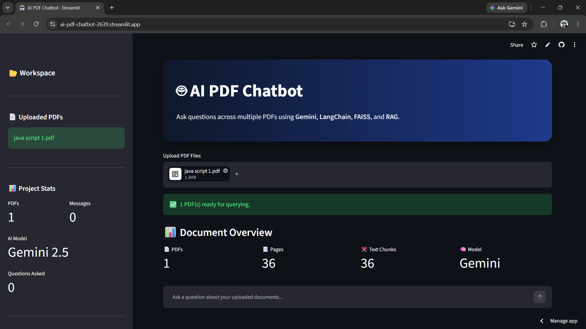
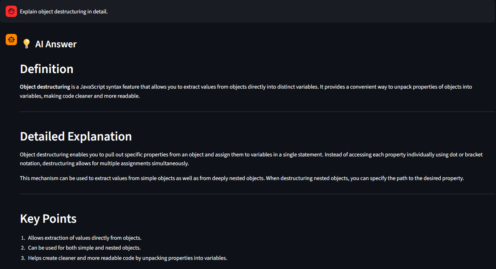
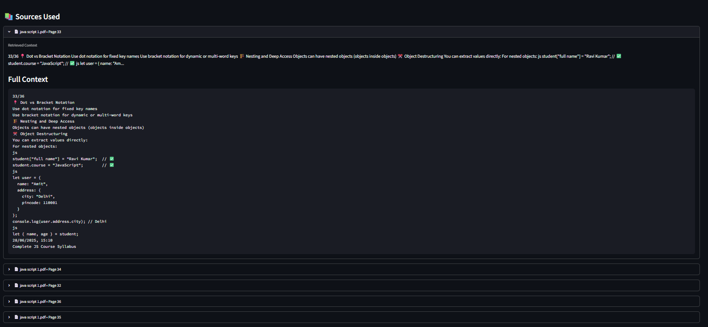

# 🤖 AI PDF Chatbot

An AI-powered PDF Question Answering application built using **Retrieval-Augmented Generation (RAG)**. Upload one or multiple PDF documents, ask questions in natural language, and receive context-aware answers powered by **Google Gemini**, **LangChain**, and **FAISS**.

🌐 **Live Demo:** https://ai-pdf-chatbot-2639.streamlit.app/

---

## ✨ Features

- 📄 Upload and chat with multiple PDF documents
- 🤖 AI-powered question answering using Google Gemini
- 🔍 Semantic search with FAISS vector database
- 🧠 Retrieval-Augmented Generation (RAG) pipeline
- 💬 Supports follow-up questions with conversational query rewriting
- 📚 Displays the source pages used to generate answers
- ⚡ Fast document retrieval using LangChain
- 🎨 Clean and responsive Streamlit interface
- 🔒 Secure API key management using Streamlit Secrets

---

## 🖼️ Screenshots

### Home Page



---

### Uploading PDFs



---

### AI Answer



---

### Source References



---

## 🛠️ Tech Stack

| Category | Technology |
|----------|------------|
| Language | Python |
| Frontend | Streamlit |
| LLM | Google Gemini |
| Framework | LangChain |
| Vector Database | FAISS |
| PDF Parsing | PyMuPDF |
| Embeddings | Google Gemini Embeddings |
| Environment | python-dotenv |

---

## 📂 Project Structure

```text
AI_PDF_Chatbot/
│
├── app.py
├── requirements.txt
├── .gitignore
├── README.md
│
├── assets/
│   ├── home.png
│   ├── upload.png
│   ├── chat.png
│   └── sources.png
│
└── utils/
    ├── chatbot.py
    ├── embeddings.py
    ├── pdf_reader.py
    ├── renderer.py
    ├── retriever.py
    ├── text_splitter.py
    └── vector_store.py
```

---

## ⚙️ How It Works

```text
PDF Upload
      │
      ▼
Extract Text (PyMuPDF)
      │
      ▼
Text Chunking
      │
      ▼
Gemini Embeddings
      │
      ▼
FAISS Vector Store
      │
      ▼
Similarity Search
      │
      ▼
Relevant Chunks Retrieved
      │
      ▼
Google Gemini
      │
      ▼
AI Answer + Source References
```

---

## 🚀 Installation

### 1. Clone the repository

```bash
git clone https://github.com/Vansh2639/AI_PDF_Chatbot.git

cd AI_PDF_Chatbot
```

---

### 2. Install dependencies

```bash
pip install -r requirements.txt
```

---

### 3. Create a `.env` file

```env
GOOGLE_API_KEY=YOUR_API_KEY
```

---

### 4. Run the application

```bash
streamlit run app.py
```

The application will open at:

```
http://localhost:8501
```

---

## 🌐 Deployment

This project is deployed using **Streamlit Community Cloud**.

### Live Application

https://ai-pdf-chatbot-2639.streamlit.app/

To deploy your own version:

1. Fork this repository.
2. Connect it to Streamlit Community Cloud.
3. Add your API key under **App Settings → Secrets**:

```toml
GOOGLE_API_KEY = "YOUR_API_KEY"
```

4. Deploy.

---

## 📚 Example Questions

Try asking:

- What is Object Destructuring?
- Explain Object Destructuring in detail.
- Give me an example of Object Destructuring.
- Summarize this document.
- What are the key points discussed?
- Explain this topic like I'm a beginner.
- What is the difference between dot notation and bracket notation?
- List the important concepts in this chapter.

---

## 🔮 Future Improvements

- OCR support for scanned PDFs
- Highlight answer text inside PDFs
- Export chat history
- Multi-model support
- Citation highlighting
- Dark/Light theme toggle
- Voice input
- Streaming token generation
- Document summarization
- PDF comparison

---

## 📦 Requirements

Some of the major libraries used:

- streamlit
- langchain
- faiss-cpu
- pymupdf
- google-genai
- python-dotenv

Install everything with:

```bash
pip install -r requirements.txt
```

---

## 👨‍💻 Author

**Vansh Garg**

Computer Science Student | AI/ML Enthusiast

GitHub: https://github.com/Vansh2639

LinkedIn: *(Add your LinkedIn profile here)*

---

## ⭐ Support

If you found this project useful:

- ⭐ Star the repository
- 🍴 Fork it
- 🐞 Report issues
- 💡 Suggest new features

Contributions are always welcome!

---

## 📄 License

This project is licensed under the **MIT License**.
